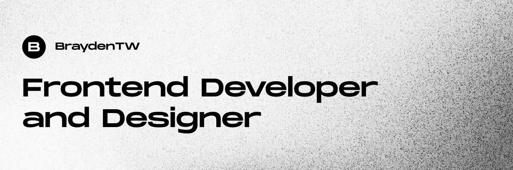
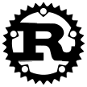

<i>Hey, I'm Brayden - a Frontend Developer and Designer.
  
I love building web apps in **React**, **indiehacking**, and exploring the world of **open-source**. If you're interested in a future collaboration or just want to say "hi", feel free send me <a href="mailto:brayden45.dev@gmail.com">an email</a>.</i>

   

### **My Skills**

### **Right now I'm learning...**

